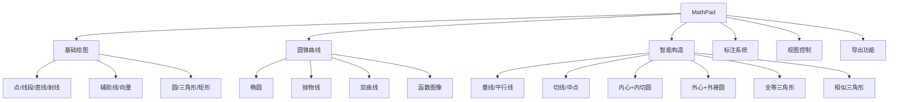

# MathPad 产品需求文档 (PRD)

> **版本**: v1.0.65  
> **最后更新**: 2026-01-17  
> **状态**: Released

---

## 1. 产品概述

### 1.1 产品定位

MathPad 是一款专为**中国中学数学教师**打造的轻量级平面几何绘图工具，完全覆盖**初中（人教版/北师大版）和高中（新课标）**的平面几何教学需求。它摒弃了 GeoGebra 的高学习门槛，专注于**"符合国内试卷排版规范"**的图形绘制，帮助教师在 3 分钟内完成一道几何大题的配图。

### 1.2 目标用户

| 用户类型 | 核心场景 | 痛点解决 |
|---------|---------|---------|
| 初/高中数学教师 | 编制周测、月考、期末试卷 | Word 画图对不齐、PPT 画图无几何逻辑 |
| 试题录入员 | 将纸质题目数字化 | 旧图模糊，需快速重绘高清矢量图 |
| 教研组 | 制作标准化试题库 | 统一图形风格，保证印刷质量 |

### 1.3 核心价值主张

- 🎯 **几何吸附**: 只有符合数学逻辑的连接（如切点、垂足、原点）才会被吸附
- 📝 **试卷级标注**: 内置国标数学符号（全等≌、相似∽、平行∥、垂直⊥）
- 🖨️ **印刷友好**: 默认黑白高对比度样式，完美适配黑白试卷打印
- 📚 **课标覆盖**: 完整支持初高中平面几何 + 解析几何知识点

---

## 2. 功能规格

### 2.1 核心功能模块



### 2.2 基础绘图工具

#### 2.2.1 智能点 (Smart Point)

| 属性 | 逻辑描述 |
|-----|---------|
| **吸附优先级** | 交点 > 中点 > 原点 > 端点 > 线上点 > 圆上点 > 网格点 |
| **临时禁用** | 按住 `Alt` 键禁用吸附 |
| **视觉反馈** | 吸附时高亮 + 文字提示（如"中点"、"垂足"） |

#### 2.2.2 线段/射线/直线/辅助线

| 功能 | 说明 |
|-----|------|
| 方向吸附 | 自动检测水平(0°)、垂直(90°)、45°、60° |
| 辅助线 | 虚线样式，用于几何证明 |
| 向量 | 带箭头的线段 |

#### 2.2.3 圆锥曲线

| 类型 | 定义方式 |
|-----|---------|
| 椭圆 | 焦点模式 / 中心+轴长 / 标准方程 |
| 抛物线 | 一般方程 / 顶点+焦点 / 焦点+准线 |
| 双曲线 | 标准方程 |
| 函数图像 | 表达式输入 (sin/cos/tan/log/exp/sqrt) |

### 2.3 智能构造工具

| 构造 | 操作 | 结果 |
|-----|------|------|
| 垂线 | 选中线 + 点 | 生成垂直线 |
| 平行线 | 选中线 + 点 | 生成平行线 |
| 中点 | 点击线段 | 标记中点 |
| 切线 | 选中圆 + 切点 | 生成切线 |
| 内心+内切圆 | 选中三角形三顶点 | 生成内心和内切圆 |
| 外心+外接圆 | 选中三角形三顶点 | 生成外心和外接圆 |
| **全等三角形** | 选中三顶点 + 变换参数 | 复制并旋转/翻转 |
| **相似三角形** | 选中三顶点 + 缩放比例 | 复制并缩放/旋转/翻转 |

### 2.4 标注系统

| 功能 | 说明 |
|-----|------|
| 顶点命名 | 自动分配 A, B, C... |
| 角度测量 | 三点定义角度并显示 |
| 边长标记 | \| \|\| \|\|\| 表示相等边 |
| 文字注释 | 自由输入文字 |

### 2.5 视图控制

| 功能 | 说明 |
|-----|------|
| 深色/浅色主题 | 一键切换 |
| 网格/坐标轴 | 显示/隐藏 |
| 缩放平移 | 鼠标滚轮 + 拖拽 |
| 快捷工具栏 | 上/下/左/右/放大/缩小/复原/点/选择 |
| 隐藏元素 | 管理元素可见性 |

### 2.6 导出功能

| 格式 | 参数 | 用途 |
|-----|------|------|
| PNG | 3x 分辨率 | 通用图片 |
| SVG | 矢量 | Word 排版 |
| JSON | 工程文件 | 保存/导入 |

---

## 3. 技术架构

### 3.1 技术栈

| 层级 | 技术 |
|-----|------|
| 框架 | React 19 + TypeScript |
| 渲染 | Konva.js (Canvas 2D) |
| 几何计算 | mathjs |
| 状态 | Zustand + zundo |
| 样式 | Tailwind CSS 4 |
| 构建 | Vite |

### 3.2 项目结构

```
src/
├── components/
│   ├── CanvasStage.tsx      # 主画布
│   ├── Toolbar.tsx          # 左侧工具栏
│   ├── RightSidebar.tsx     # 右侧元素列表
│   ├── FloatingPropertyPanel.tsx  # 属性面板
│   ├── ConicPanel.tsx       # 圆锥曲线面板
│   ├── TriangleTransformPanel.tsx # 全等/相似面板
│   ├── QuickToolbar.tsx     # 底部快捷工具栏
│   ├── FormulaInputBar.tsx  # 函数输入栏
│   ├── StatusBar.tsx        # 状态栏
│   └── elements/            # 几何元素渲染组件
├── store/
│   ├── geoStore.ts          # 几何状态 + undo/redo
│   ├── toolStore.ts         # 工具状态
│   └── viewStore.ts         # 视图状态
├── core/
│   ├── geometry.ts          # 几何计算
│   ├── snapping.ts          # 智能吸附
│   ├── triangleTransform.ts # 三角形变换
│   └── *.ts                 # 圆锥曲线计算
└── types/
    └── geoElements.ts       # 类型定义
```

---

## 4. 版本历史

### v1.0.65 (2026-01-17) ✅ 当前版本

- [x] 底部快捷工具栏（9个按钮）
- [x] 属性面板「隐藏元素」按钮
- [x] 深色模式网格线优化
- [x] 自定义图标（垂线/平行线/相似三角形）
- [x] 旋转角度手动输入 (0-360°)
- [x] 代码清理（移除冗余组件）

### v1.0.64 (2026-01-16)

- [x] 全等三角形工具
- [x] 相似三角形工具
- [x] 三角形变换面板

### v1.0.0 (2026-01-14)

- [x] 椭圆/抛物线/双曲线
- [x] 函数图像
- [x] 圆锥曲线面板

### v0.6.0 - v0.9.0

- [x] 坐标系与网格
- [x] localStorage 持久化
- [x] 深色主题
- [x] 状态栏

### v0.2.0 - v0.5.0

- [x] 基础绘图工具
- [x] 撤销/重做
- [x] 快捷键
- [x] 智能吸附
- [x] 垂线/平行线/中点
- [x] 内心/外心 + 内切圆/外接圆

---

## 5. 知识点覆盖

| 知识点 | 初中 | 高中 | 版本 |
|-------|:----:|:----:|:----:|
| 三角形全等 | ✅ | | v1.0.64 |
| 三角形相似 | ✅ | | v1.0.64 |
| 勾股定理 | ✅ | | v0.2.0 |
| 平行四边形 | ✅ | | v0.3.0 |
| 圆的性质 | ✅ | | v0.4.0 |
| 切线 | ✅ | | v0.4.0 |
| 向量 | | ✅ | v0.5.0 |
| 椭圆 | | ✅ | v1.0.0 |
| 抛物线 | | ✅ | v1.0.0 |
| 双曲线 | | ✅ | v1.0.0 |
| 函数图像 | | ✅ | v0.6.0 |

---

## 6. 未来规划

### v1.1.0 (计划)

- [ ] 图形模板库
- [ ] 全等/相似符号标注
- [ ] 圆周角/圆心角标记

### v1.2.0 (计划)

- [ ] 几何变换（轴对称/旋转/平移）
- [ ] 角平分线构造
- [ ] 中垂线构造

---

*文档更新: 2026-01-17*
