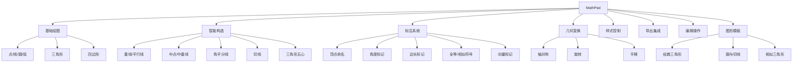

# MathPad 产品需求文档 (PRD)

> **版本**: v3.0 (Plane Geometry for China Curriculum)  
> **最后更新**: 2026-01-14  
> **状态**: Approved

---

## 1. 产品概述

### 1.1 产品定位

MathPad 是一款专为**中国中学数学教师**打造的轻量级平面几何绘图工具，完全覆盖**初中（人教版/北师大版）和高中（新课标）**的平面几何教学需求。它摒弃了 GeoGebra 的高学习门槛，专注于**"符合国内试卷排版规范"**的图形绘制，帮助教师在 3 分钟内完成一道几何大题的配图。

### 1.2 目标用户

| 用户类型 | 核心场景 | 痛点解决 |
|---------|---------|---------|
| 初/高中数学教师 | 编制周测、月考、期末试卷 | Word 画图对不齐、PPT 画图无几何逻辑 |
| 试题录入员 | 将纸质题目数字化 | 旧图模糊，需快速重绘高清矢量图 |
| 教研组 | 制作标准化试题库 | 统一图形风格，保证印刷质量 |

### 1.3 核心价值主张

- 🎯 **几何吸附**: 只有符合数学逻辑的连接（如切点、垂足）才会被吸附
- 📝 **试卷级标注**: 内置国标数学符号（全等≌、相似∽、平行∥、垂直⊥）
- 🖨️ **印刷友好**: 默认黑白高对比度样式，完美适配黑白试卷打印
- 📚 **课标覆盖**: 完整支持初高中平面几何知识点

---

## 2. 功能规格

### 2.1 核心功能模块



### 2.2 基础绘图工具 (Drawing Tools)

#### 2.2.1 智能点 (Smart Point)

| 属性 | 逻辑描述 |
|-----|---------|
| **吸附优先级** | 交点 > 中点 > 端点 > 线上点 > 圆上点 > 网格点 |
| **临时禁用** | 按住 `Alt` 键禁用吸附 |
| **视觉反馈** | 吸附时高亮 + 文字提示（如"中点"、"垂足"） |
| **点样式** | 实心点（默认）、空心点（排除点）、叉号点 |

#### 2.2.2 线段/射线/直线

| 功能 | 说明 |
|-----|------|
| 方向吸附 | 自动检测水平(0°)、垂直(90°)、45°、60° 并吸附 |
| 延长线 | 可将线段延长为射线或直线 |
| 样式 | 实线/虚线/点划线 |

#### 2.2.3 三角形工具

| 预设类型 | 说明 |
|---------|------|
| 任意三角形 | 三次点击确定三个顶点 |
| 等边三角形 | 点击确定一个顶点，拖拽确定大小和旋转 |
| 等腰三角形 | 先确定底边两点，再确定顶点（自动吸附到中垂线） |
| 直角三角形 | 先确定直角顶点，再确定两条直角边 |
| 30-60-90 | 特殊直角三角形预设 |
| 45-45-90 | 等腰直角三角形预设 |

#### 2.2.4 四边形工具 ⭐ 新增

| 预设类型 | 特性 | 构造方式 |
|---------|------|---------|
| 平行四边形 | 对边平行且相等 | 确定三个顶点，第四点自动计算 |
| 矩形 | 四个直角 | 确定两个对角顶点 |
| 正方形 | 四边相等+四个直角 | 确定一条边 |
| 菱形 | 四边相等 | 确定一条对角线和一个顶点 |
| 梯形 | 一组对边平行 | 确定平行的两边 |
| 等腰梯形 | 两腰相等 | 确定底边和高度 |

#### 2.2.5 圆与弧工具

| 工具 | 说明 |
|-----|------|
| 圆心+半径 | 点击圆心，拖拽确定半径 |
| 三点画圆 | 过三点的唯一圆 |
| 弧 | 选择圆 + 两点，生成弧 |
| 扇形 | 选择圆心 + 两条半径，生成扇形（用于面积题） |
| 弦 | 选择圆上两点，自动生成弦和对应弧 |

### 2.3 智能构造工具 (Construction Tools)

#### 2.3.1 基础构造

| 构造 | 操作 | 默认样式 |
|-----|------|---------|
| 垂线 | 选中线 + 点 | 1px 虚线 |
| 平行线 | 选中线 + 点 | 1px 虚线 |
| 中点 | 选中线段 | 实心点 |
| 中垂线 | 选中线段 | 1px 虚线 |
| 角平分线 | 选中三个点 | 1px 虚线 |

#### 2.3.2 圆相关构造

| 构造 | 操作 | 结果 |
|-----|------|------|
| 切线 | 选中圆 + 圆外点 | 两条切线 + 自动标记切点 |
| 公切线 | 选中两个圆 | 外公切线/内公切线 |
| 圆心角 | 选中圆 + 弧 | 标记圆心角 |
| 圆周角 | 选中弧 + 圆上点 | 标记圆周角 |

#### 2.3.3 三角形五心 ⭐ 新增

| 名称 | 定义 | 构造 |
|-----|------|------|
| 重心 (G) | 三条中线交点 | 选中三角形 → 一键生成 |
| 垂心 (H) | 三条高线交点 | 选中三角形 → 一键生成 |
| 内心 (I) | 三条角平分线交点 | 选中三角形 → 生成内心 + 内切圆 |
| 外心 (O) | 三条中垂线交点 | 选中三角形 → 生成外心 + 外接圆 |
| 旁心 | 三角形旁切圆圆心 | 选中三角形 + 指定边 |

### 2.4 标注系统 (Annotation System)

#### 2.4.1 顶点自动命名

| 功能 | 说明 |
|-----|------|
| 命名规则 | 按创建顺序分配 A, B, C, D... |
| 三角形 | 自动命名为 △ABC |
| 圆 | 自动命名为 ⊙O |
| 避让算法 | 标签出现在"最空旷"方向 |
| 下标支持 | A₁, B₂, P' (撇号表示对应点) |

#### 2.4.2 角度标记

| 类型 | 样式 | 触发 |
|-----|------|------|
| 锐角 | 单弧线 | 自动识别 |
| 直角 | 方框符号 ⊾ | 自动识别 90° |
| 钝角 | 双弧线 | 自动识别 |
| 标签 | α, β, ∠ABC | LaTeX 输入 |

#### 2.4.3 边长关系标记

| 符号 | 含义 | 用途 |
|-----|------|------|
| `\|` | 单杠 | 表示第一组相等边 |
| `\|\|` | 双杠 | 表示第二组相等边 |
| `\|\|\|` | 三杠 | 表示第三组相等边 |
| `>` | 单箭头 | 表示第一组平行边 |
| `>>` | 双箭头 | 表示第二组平行边 |

#### 2.4.4 全等/相似符号 ⭐ 新增

| 操作 | 结果 |
|-----|------|
| 选中两个三角形 → 全等 | 显示 △ABC ≌ △DEF |
| 选中两个三角形 → 相似 | 显示 △ABC ∽ △DEF |
| 相似比标注 | 可添加 k = 2:1 等比例 |

#### 2.4.5 向量标记 ⭐ 新增

| 功能 | 说明 |
|-----|------|
| 向量箭头 | 在线段末端添加箭头 |
| 向量符号 | $\overrightarrow{AB}$ |
| 向量加法 | 显示平行四边形法则辅助线 |

### 2.5 几何变换工具 ⭐ 新增

#### 2.5.1 轴对称

| 操作 | 说明 |
|-----|------|
| 选择图形 + 对称轴 | 生成关于该轴的对称图形 |
| 对应点连线 | 可选显示对应点连线（虚线） |
| 样式 | 原图形实线，像虚线（可配置） |

#### 2.5.2 旋转

| 操作 | 说明 |
|-----|------|
| 选择图形 + 旋转中心 | 输入角度或拖拽旋转 |
| 常用角度 | 快捷按钮：90°, 180°, 60°, 45° |
| 旋转弧 | 可选显示旋转路径弧线 |

#### 2.5.3 平移

| 操作 | 说明 |
|-----|------|
| 选择图形 + 绘制向量 | 按向量方向和距离平移 |
| 对应点连线 | 可选显示（表示平移方向） |

### 2.6 样式与视图

| 功能 | 细节 |
|-----|------|
| **线型** | 实线、虚线、点划线 |
| **线宽** | 粗 (2px)、细 (1px) |
| **区域填充** | 斜线阴影、点阵、灰色填充 |
| **画布** | 纯白、网格、坐标轴 |

### 2.7 图形模板库 ⭐ 新增

快速插入常用几何图形：

| 类别 | 模板 |
|-----|------|
| **三角形** | 带高线、带中线、带角平分线、内切圆、外接圆 |
| **四边形** | 平行四边形对角线、矩形对角线、菱形对角线 |
| **圆** | 圆内接三角形、圆内接四边形、切线三角形 |
| **相似** | 相似三角形对（含比例标注） |
| **证明** | "蝴蝶定理"图、"梯形中位线"图 |

### 2.8 编辑操作

#### 2.8.1 撤销/重做

| 快捷键 | 功能 |
|-------|------|
| `Ctrl+Z` / `⌘+Z` | 撤销 |
| `Ctrl+Y` / `⌘+Shift+Z` | 重做 |
| 历史深度 | 50 步 |

#### 2.8.2 键盘快捷键

| 快捷键 | 功能 |
|-------|------|
| `V` | 选择工具 |
| `P` | 点工具 |
| `L` | 线段工具 |
| `C` | 圆工具 |
| `T` | 三角形工具 |
| `Q` | 四边形工具 |
| `Delete` | 删除选中 |
| `Escape` | 取消操作 |
| `Alt` (按住) | 禁用吸附 |

### 2.9 导出集成

| 格式 | 参数 | 用途 |
|-----|------|------|
| PNG | 3x 分辨率 | 通用图片 |
| SVG | 矢量 | Word 排版 |
| 剪贴板 | Ctrl+V | 快速粘贴 |

**尺寸预设**：
- 单栏插图 (300px)
- 双栏插图 (150px)  
- 全宽插图 (600px)

---

## 3. 数据模型

### 3.1 核心实体

```typescript
type GeoType = 
  | 'point' | 'line' | 'circle' | 'arc' | 'polygon' 
  | 'angle_mark' | 'segment_mark' | 'label' | 'vector';

interface GeoElement {
  id: string;
  type: GeoType;
  visible: boolean;
  style: StyleProps;
  label?: LabelProps;
  definition: GeoDefinition;
  dependencies: string[]; // 自动从 definition 提取
}

type GeoDefinition =
  // 基础
  | { type: 'free' }
  | { type: 'on_line'; line: string; t: number }
  | { type: 'on_circle'; circle: string; angle: number }
  // 构造
  | { type: 'midpoint'; p1: string; p2: string }
  | { type: 'intersection'; el1: string; el2: string }
  | { type: 'perpendicular'; line: string; point: string }
  | { type: 'parallel'; line: string; point: string }
  | { type: 'angle_bisector'; p1: string; vertex: string; p2: string }
  | { type: 'tangent_point'; circle: string; external: string }
  // 三角形五心
  | { type: 'centroid'; triangle: string }
  | { type: 'orthocenter'; triangle: string }
  | { type: 'incenter'; triangle: string }
  | { type: 'circumcenter'; triangle: string }
  // 变换
  | { type: 'reflection'; source: string; axis: string }
  | { type: 'rotation'; source: string; center: string; angle: number }
  | { type: 'translation'; source: string; vector: string };
```

### 3.2 级联更新

采用 DAG 管理依赖，拖动父元素自动更新所有子元素。

### 3.3 历史记录

```typescript
interface HistoryState {
  past: GeoState[];
  present: GeoState;
  future: GeoState[];
}
```

---

## 4. 技术架构

### 4.1 技术栈

| 层级 | 技术 |
|-----|------|
| 框架 | React 19 + TypeScript |
| 渲染 | Konva.js |
| 几何计算 | mathjs (自研扩展) |
| LaTeX | KaTeX |
| 状态 | Zustand + temporal |
| 构建 | Vite |

### 4.2 项目结构

```
src/
├── components/
│   ├── CanvasStage.tsx
│   ├── Toolbar.tsx
│   ├── elements/
│   └── panels/
├── store/
│   ├── geoStore.ts      # 几何状态 + undo/redo
│   ├── toolStore.ts
│   └── viewStore.ts
├── core/
│   ├── geometry.ts      # 几何计算
│   ├── snapping.ts      # 吸附
│   ├── construction.ts  # 构造工具
│   └── transform.ts     # 几何变换
├── templates/           # 图形模板
├── types/
└── utils/
```

---

## 5. 用户界面

```
┌────────────────────────────────────────────────────────────┐
│  MathPad Geometry   [撤销][重做]   [导出▼]                 │
├────┬───────────────────────────────────────────────┬───────┤
│ 绘 │                                               │ 样  │
│ 图 │                                               │ 式  │
│ 工 │                                               │     │
│ 具 │             Infinite Canvas                   ├───────┤
├────┤          (吸附提示 + 右键菜单)                │ 元  │
│ 构 │                                               │ 素  │
│ 造 │                                               │ 列  │
│ 工 │                                               │ 表  │
│ 具 │                                               │     │
├────┤                                               ├───────┤
│ 标 │                                               │ 模  │
│ 注 │                                               │ 板  │
│ 工 │                                               │ 库  │
│ 具 │                                               │     │
└────┴───────────────────────────────────────────────┴───────┘
```

---

## 6. 迭代规划

### v0.2.0 ✅ (已完成 - 基础功能)

- [x] 撤销/重做 (zundo)
- [x] 键盘快捷键 (V/P/L/C/Delete/Ctrl+Z/Y)
- [x] 智能吸附增强 (中点/线上/圆上)
- [x] 垂线/平行线/中点构造
- [x] 顶点自动命名 (A, B, C...)

### v0.3.0 ✅ (已完成 - 四边形与标注)

- [x] 矩形工具 (快捷键 R)
- [x] 边长关系标记（|）
- [x] 直角标记（自动识别 90° 显示 ⊾）
- [x] PNG 尺寸预设（单栏/双栏/全宽）

### v0.4.0 ✅ (已完成 - 圆与变换)

- [x] 弧/扇形工具 (Arc.tsx)
- [x] 切线构造 (getTangentPoints)
- [x] 三角形内心 + 内切圆
- [x] 三角形外心 + 外接圆

### v0.5.0 ✅ (已完成 - 模板与效率)

- [x] 向量工具
- [ ] 图形模板库 (待实现)
- [ ] 圆周角/圆心角标记 (待实现)
- [ ] 全等/相似符号 (待实现)

### v0.6.0 ✅ (已完成 - 解析几何)

- [x] 坐标系 (Grid + Axes)
- [x] 函数图像 (FunctionGraph.tsx)

### v0.7.0 ✅ (已完成 - 持久化)

- [x] localStorage 自动保存
- [x] JSON 文件导入/导出
- [x] 清空画布功能

### v0.8.0 ✅ (已完成 - UI/UX优化)

- [x] 原点居中 (画布中央)
- [x] 状态栏 (工具提示 + 坐标显示)
- [x] 鼠标位置实时追踪

### v0.9.0 (当前 - 几何证明标记)

- [ ] 全等符号 (≅)
- [ ] 相似符号 (∽)
- [ ] 辅助线样式

### v0.10.0 (批注与文字)

- [ ] 文字注释工具
- [ ] 题目/演示模式切换

### v0.11.0 (圆锥曲线)

- [ ] 椭圆/双曲线/抛物线

### v0.12.0 (图形模板库)

- [ ] 预设三角形/四边形

### v0.13.0 (暗色主题)

- [ ] 主题切换

### 7.1 中国课标知识点覆盖

| 知识点 | 初中 | 高中 | MathPad 支持 |
|-------|------|------|-------------|
| 三角形全等 | ✅ | | v0.3.0 |
| 三角形相似 | ✅ | | v0.3.0 |
| 勾股定理 | ✅ | | v0.2.0 |
| 平行四边形 | ✅ | | v0.3.0 |
| 圆的性质 | ✅ | | v0.4.0 |
| 切线 | ✅ | | v0.4.0 |
| 轴对称 | ✅ | | v0.4.0 |
| 旋转 | ✅ | | v0.4.0 |
| 向量 | | ✅ | v0.5.0 |
| 解析几何 | | ✅ | v0.6.0 |

### 7.2 更新日志

**v3.0 (2026-01-14)**
- 新增：四边形工具（6种预设）
- 新增：三角形五心构造
- 新增：几何变换（轴对称/旋转/平移）
- 新增：全等/相似符号标记
- 新增：向量标记
- 新增：图形模板库
- 优化：版本规划细化到 v0.7.0
